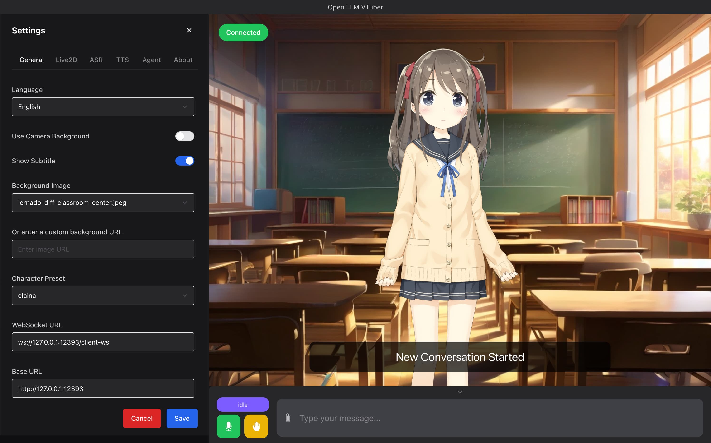
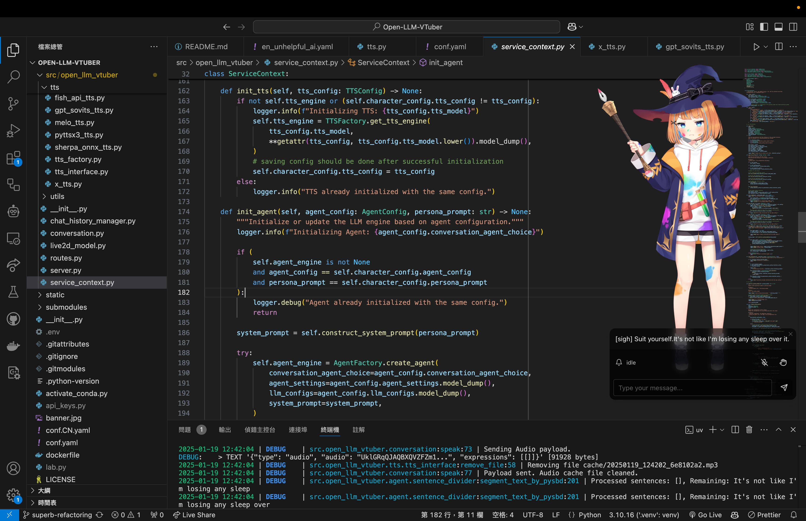
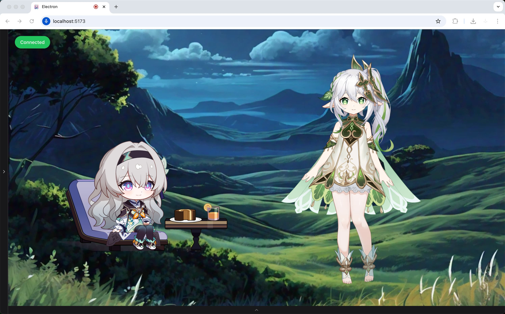

<h1 align="center">Open-LLM-VTuber</h1>
<h3 align="center">

[](https://github.com/t41372/Open-LLM-VTuber/releases) 
[](https://github.com/t41372/Open-LLM-VTuber/blob/master/LICENSE) 
[](https://github.com/Open-LLM-VTuber/Open-LLM-VTuber/actions/workflows/codeql.yml)
[](https://github.com/Open-LLM-VTuber/Open-LLM-VTuber/actions/workflows/ruff.yml)
[](https://hub.docker.com/r/t41372/open-llm-vtuber) 
[](https://github.com/users/t41372/projects/1/views/5)
[](https://qm.qq.com/q/ngvNUQpuKI)
[-pd93364606-white?style=flat&logo=qq&logoColor=white)](https://pd.qq.com/s/tt54r3bu)


[](https://www.buymeacoffee.com/yi.ting)
[](https://discord.gg/3UDA8YFDXx)

English README | [中文README](https://github.com/t41372/Open-LLM-VTuber/blob/main/README.CN.md)

[Documentation](https://open-llm-vtuber.github.io/docs/quick-start)

</h3>


> 常见问题 Common Issues doc (Written in Chinese): https://docs.qq.com/pdf/DTFZGQXdTUXhIYWRq
>
> User Survey: https://forms.gle/w6Y6PiHTZr1nzbtWA
>
> 调查问卷(中文): https://wj.qq.com/s2/16150415/f50a/


> :warning: This project is in its early stages and is currently under **active development**.

> :warning: If you want to run the server remotely and access it on a different machine, such as running the server on your computer and access it on your phone, you will need to configure `https`, because the microphone on the front end will only launch in a secure context (a.k.a. https or localhost). See [MDN Web Doc](https://developer.mozilla.org/en-US/docs/Web/API/MediaDevices/getUserMedia). Therefore, you should configure https with a reverse proxy to access the page on a remote machine (non-localhost).


## ⭐️ What is this project?


**Open-LLM-VTuber** is a unique **voice-interactive AI companion** that not only supports **real-time voice conversations** but also features a lively **Live2D avatar**. All functionalities can run completely offline on your computer!

You can treat it as your personal AI companion — whether you want a `virtual girlfriend`, `boyfriend`, `cute pet`, or any other character, it can meet your expectations. The project fully supports `Windows`, `macOS`, and `Linux`, and offers two usage modes: web version and desktop client (with special support for **transparent background desktop pet mode**, allowing the AI companion to accompany you anywhere on your screen).

Although the long-term memory feature is temporarily removed (coming back soon), thanks to the persistent storage of chat logs, you can always continue your previous unfinished conversations without losing any precious interactive moments.

In terms of backend support, we have integrated a rich variety of LLM inference, text-to-speech, and speech recognition solutions. If you want to customize your AI companion, you can refer to the [Character Customization Guide](https://open-llm-vtuber.github.io/docs/user-guide/live2d) to customize your AI companion's appearance and persona.

The reason it's called `Open-LLM-Vtuber` instead of `Open-LLM-Companion` or `Open-LLM-Waifu` is because the project's initial development goal was to use open-source solutions that can run offline on platforms other than Windows to recreate the closed-source AI Vtuber `neuro-sama`.

This project underwent code refactoring after version `v1.0.0` and is currently in active development, with many exciting features coming soon! 🚀 Check out our [Roadmap](https://github.com/users/t41372/projects/1/views/5) to learn about update plans.


### 👀 Demo
|  |  |
|:---:|:---:|
|  |  |


## ✨ Features & Highlights

- 🖥️ **Cross-platform support**: Perfect compatibility with macOS, Linux, and Windows. We support NVIDIA and non-NVIDIA GPUs, with options to run on CPU or use cloud APIs for resource-intensive tasks. Some components support GPU acceleration on macOS.

- 🔒 **Offline mode support**: Run completely offline using local models - no internet required. Your conversations stay on your device, ensuring privacy and security.

- 💻 **Attractive and powerful web and desktop clients**: Offers both web version and desktop client usage modes, supporting rich interactive features and personalization settings. The desktop client can switch freely between window mode and desktop pet mode, allowing the AI companion to be by your side at all times.

- 🎯 **Advanced interaction features**:
  - 🎤 Voice interruption without headphones (AI won't hear its own voice)
  - 🫱 Touch feedback, interact with your AI companion through clicks or drags
  - 😊 Live2D expressions, set emotion mapping to control model expressions from the backend
  - 🐱 Pet mode, supporting transparent background, global top-most, and mouse click-through - drag your AI companion anywhere on the screen
  - 🗣️ AI proactive speaking feature
  - 💾 Chat log persistence, switch to previous conversations anytime
  - 🌍 TTS translation support (e.g., chat in Chinese while AI uses Japanese voice)

- 🧠 **Extensive model support**:
  - 🤖 Large Language Models (LLM): Ollama, OpenAI (and any OpenAI-compatible API), Gemini, Claude, Mistral, DeepSeek, Zhipu AI, GGUF, LM Studio, vLLM, etc.
  - 🎙️ Automatic Speech Recognition (ASR): sherpa-onnx, FunASR, Faster-Whisper, Whisper.cpp, Whisper, Groq Whisper, Azure ASR, etc.
  - 🔊 Text-to-Speech (TTS): sherpa-onnx, pyttsx3, MeloTTS, Coqui-TTS, GPTSoVITS, Bark, CosyVoice, Edge TTS, Fish Audio, Azure TTS, etc.

- 🔧 **Highly customizable**:
  - ⚙️ **Simple module configuration**: Switch various functional modules through simple configuration file modifications, without delving into the code
  - 🎨 **Character customization**: Import custom Live2D models to give your AI companion a unique appearance. Shape your AI companion's persona by modifying the Prompt. Perform voice cloning to give your AI companion the voice you desire
  - 🧩 **Flexible Agent implementation**: Inherit and implement the Agent interface to integrate any Agent architecture, such as HumeAI EVI, OpenAI Her, Mem0, etc.
  - 🔌 **Good extensibility**: Modular design allows you to easily add your own LLM, ASR, TTS, and other module implementations, extending new features at any time


## 👥 User Reviews
> Thanks to the developer for open-sourcing and sharing the girlfriend for everyone to use
> 
> This girlfriend has been used over 100,000 times


## 🚀 Quick Start

Read https://open-llm-vtuber.github.io/docs/quick-start for quick start. For pages that havn't yet received an English translation, please use your browser translation for now.


## ☝ Update
> :warning: `v1.0.0` has breaking changes and requires re-deployment. You *may* still update via the method below, but the `conf.yaml` file is incompatible and most of the dependencies needs to be reinstalled with `uv`. For those who came from versions before `v1.0.0`, I recommend deploy this project again with the [latest deployment guide](https://open-llm-vtuber.github.io/docs/quick-start).

[To be complete]

Run the upgrade script `python upgrade.py` to update.

or run the following command inside the project repository:

```sh
git stash push -u -m "Stashing all local changes"
git fetch
git pull
git stash pop
```


# 🎉🎉🎉 Related Projects

[ylxmf2005/LLM-Live2D-Desktop-Assitant](https://github.com/ylxmf2005/LLM-Live2D-Desktop-Assitant)
- Your Live2D desktop assistant powered by LLM! Available for both Windows and MacOS, it senses your screen, retrieves clipboard content, and responds to voice commands with a unique voice. Featuring voice wake-up, singing capabilities, and full computer control for seamless interaction with your favorite character.


# Acknowledgement
Awesome projects I learned from

- https://github.com/dnhkng/GlaDOS
- https://github.com/SchwabischesBauernbrot/unsuperior-ai-waifu
- https://codepen.io/guansss/pen/oNzoNoz
- https://github.com/Ikaros-521/AI-Vtuber
- https://github.com/zixiiu/Digital_Life_Server


## Star History

[](https://star-history.com/#t41372/open-llm-vtuber&Date)


