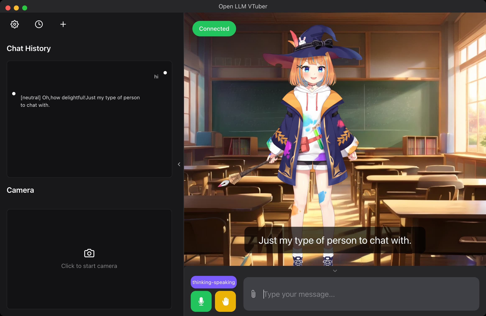
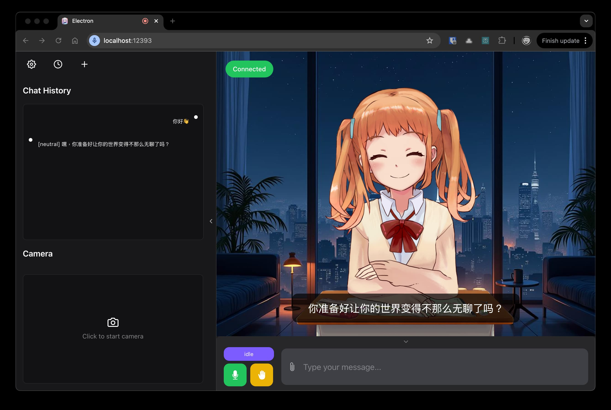
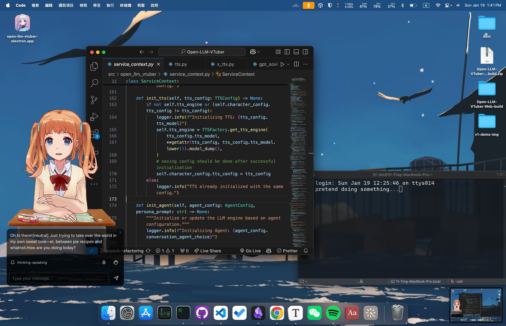

<h1 align="center">Open-LLM-VTuber</h1>
<h3 align="center">

[](https://github.com/t41372/Open-LLM-VTuber/releases) 
[](https://github.com/t41372/Open-LLM-VTuber/blob/master/LICENSE) 
[](https://fossa.app/projects/custom%2B50595%2Fgithub.com%2Ft41372%2FOpen-LLM-VTuber?ref=badge_shield&issueType=security)
[](https://hub.docker.com/r/t41372/open-llm-vtuber) 
[](https://github.com/users/t41372/projects/1/views/5)
[](https://qm.qq.com/q/ngvNUQpuKI)
[-pd93364606-white?style=flat&logo=qq&logoColor=white)](https://pd.qq.com/s/tt54r3bu)


[](https://www.buymeacoffee.com/yi.ting)
[](https://discord.gg/3UDA8YFDXx)

English README | [中文README](https://github.com/t41372/Open-LLM-VTuber/blob/main/README.CN.md)

[Documentation](https://open-llm-vtuber.github.io/docs/quick-start)

</h3>


> 常见问题 Common Issues doc (Written in Chinese): https://docs.qq.com/pdf/DTFZGQXdTUXhIYWRq
>
> User Survey: https://forms.gle/w6Y6PiHTZr1nzbtWA
>
> 调查问卷(中文): https://wj.qq.com/s2/16150415/f50a/


> :warning: This project is in its early stages and is currently under **active development**.

> :warning: If you want to run the server remotely and access it on a different machine, such as running the server on your computer and access it on your phone, you will need to configure `https`, because the microphone on the front end will only launch in a secure context (a.k.a. https or localhost). See [MDN Web Doc](https://developer.mozilla.org/en-US/docs/Web/API/MediaDevices/getUserMedia). Therefore, you should configure https with a reverse proxy to access the page on a remote machine (non-localhost).


## ⭐️ What is this project?


**Open-LLM-VTuber** is a voice to voice agent with voice interruption capability and a Live2D talking face running locally on your computer (offline mode available). 

It's your `virtual girlfriend`/`boyfriend`/`pet`/`something_else` running locally on `macOS`/`Linux`/`Windows`. Web frontend and electron frontend (with transparent background!) are available.

Long-term memory is temporily removed (will be added back very soon), but chat history persistence allows you to resume old conversations at any time.

This project supports a wide range of LLM backend, text-to-speech models, and speech recognition models. You can use your custom Live2D model by following the [documentation](https://open-llm-vtuber.github.io/docs/user-guide/live2d). 

This project started as an attempt to recreate the closed-source AI VTuber `neuro-sama` with open-source alternatives that can run offline on platforms other than Windows.


|  |  |
|:---:|:---:|
|  |  |


### 👀 Demo

English demo:


https://github.com/user-attachments/assets/f13b2f8e-160c-4e59-9bdb-9cfb6e57aca9


English Demo:
[YouTube](https://youtu.be/gJuPM_2qEZc)


中文 demo:

[BiliBili](https://www.bilibili.com/video/BV1krHUeRE98/), [YouTube](https://youtu.be/cb5anPTNklw)


## ✨ Features & Highlights

- 🖥️ **Cross-Platform Support**: Works seamlessly on macOS, Linux, and Windows. We support both Nvidia and non-Nvidia GPUs, with options to run on CPU or use cloud APIs for resource-intensive tasks. macOS GPU acceleration are available on some components.

- 🔒 **Offline mode available**: Run completely offline with local models - no internet required. Your conversations stay private and secure on your machine.

- 🎯 **Advanced Interaction**:
  - 🎤 Voice interruption without headphones (AI won't hear itself)
  - 🐱 Pet mode with transparent background - drag your companion anywhere on screen
  - 🗣️ Proactive AI speech capabilities
  - 💾 Chat history persistence to resume conversations
  - 🌍 Audio translation support (e.g., chat in English, hear Japanese speech)

- 🧠 **Extensive Model Support**:
  - 🤖 LLMs: Ollama, OpenAI (and any OpenAI Compatible API), Gemini, Claude, Mistral, DeepSeek, Zhipu, GGUF, LM Studio, vLLM, and more
  - 🎵 Customizable Speech Recognition and TTS backends
  - 🖥️ Web and desktop frontends with beautiful UI

The project is actively developed with a rewritten codebase after `v1.0.0` and many exciting features planned ahead! 🚀 Feel free to check out our [Roadmap](https://github.com/users/t41372/projects/1/views/5) to what's ahead.


## 🚀 Quick Start

Read https://open-llm-vtuber.github.io/docs/quick-start for quick start. It will be translated to English once things are more stable.


## ☝ Update
> :warning: `v1.0.0` has breaking changes and requires re-deployment. You *may* still update via the method below, but the `conf.yaml` file is incompatible and most of the dependencies needs to be reinstalled with `uv`. For those who came from versions before `v1.0.0`, I recommend deploy this project again with the [latest deployment guide](https://open-llm-vtuber.github.io/docs/quick-start).

[To be complete]

Run the upgrade script `python upgrade.py` to update.

or run the following command inside the project repository:

```sh
git stash push -u -m "Stashing all local changes"
git fetch
git pull
git stash pop
```


# 🎉🎉🎉 Related Projects

[ylxmf2005/LLM-Live2D-Desktop-Assitant](https://github.com/ylxmf2005/LLM-Live2D-Desktop-Assitant)
- Your Live2D desktop assistant powered by LLM! Available for both Windows and MacOS, it senses your screen, retrieves clipboard content, and responds to voice commands with a unique voice. Featuring voice wake-up, singing capabilities, and full computer control for seamless interaction with your favorite character.


# Acknowledgement
Awesome projects I learned from

- https://github.com/dnhkng/GlaDOS
- https://github.com/SchwabischesBauernbrot/unsuperior-ai-waifu
- https://codepen.io/guansss/pen/oNzoNoz
- https://github.com/Ikaros-521/AI-Vtuber
- https://github.com/zixiiu/Digital_Life_Server


## Star History

[](https://star-history.com/#t41372/open-llm-vtuber&Date)


